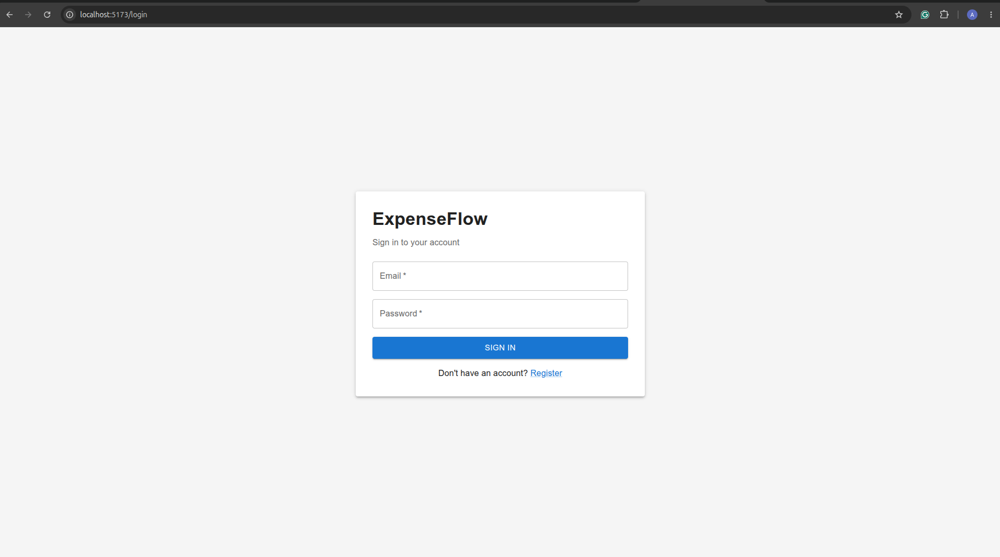
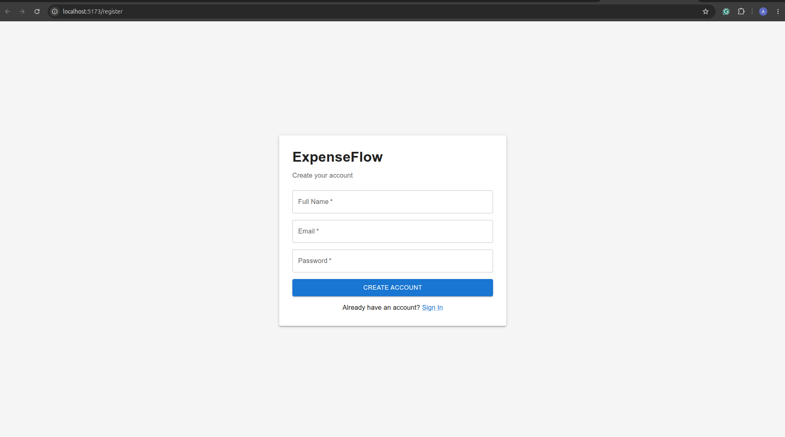
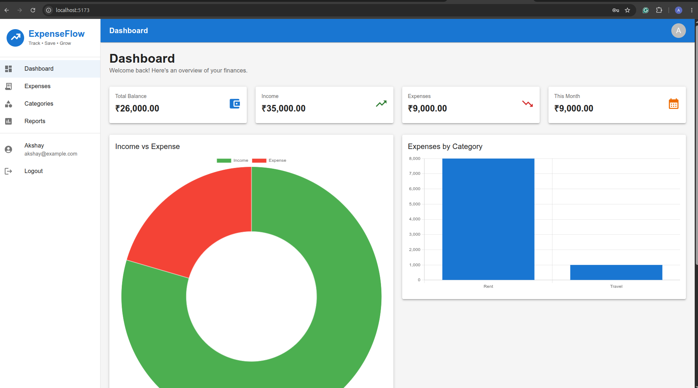
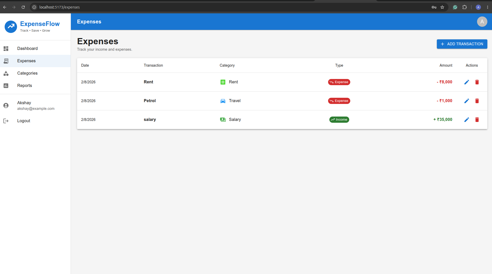
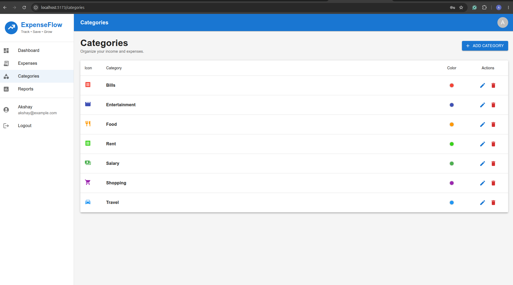
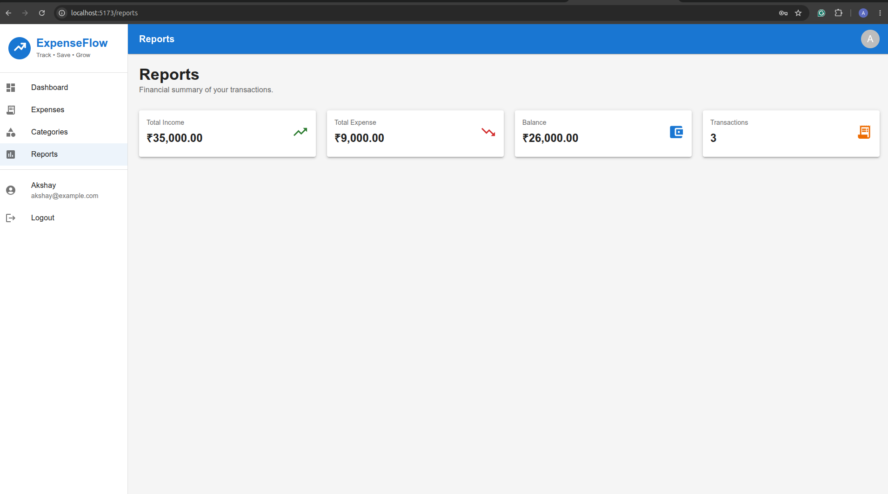

# 💰 ExpenseFlow

ExpenseFlow is a modern full-stack expense management application built with **React, TypeScript, Node.js, Express, and MongoDB**. It enables users to manage income and expenses, organize transactions using categories, and visualize their financial data through an interactive dashboard.

> **Project Status:** 🚧 Development (Version 1.0)

---

# ✨ Features

- 🔐 User Authentication (JWT)
- 📊 Dashboard Overview
- 💵 Income & Expense Management
- 📂 Category Management
- 📈 Reports & Financial Summary
- 📱 Responsive Material UI Interface

---

# 🛠 Tech Stack

## Frontend

- React
- TypeScript
- Vite
- Material UI
- React Router
- Chart.js

## Backend

- Node.js
- Express.js
- TypeScript
- MongoDB
- Mongoose
- JWT Authentication

---

# 📸 Application Screenshots

## Login



---

## Register



---

## Dashboard



---

## Expenses



---

## Categories



---

## Reports



---

# 📁 Project Structure

```text
ExpenseFlow
│
├── backend
├── frontend
├── screenshots
├── package.json
├── package-lock.json
└── README.md
```

---

# 🚀 Installation

## Clone Repository

```bash
git clone git@github.com:akshayachar03/ExpenseFlow.git
cd ExpenseFlow
```

---

## Install Dependencies

### Root

```bash
npm install
```

### Frontend

```bash
cd frontend
npm install
```

### Backend

```bash
cd ../backend
npm install
```

---

# ▶️ Running the Application

## Backend

```bash
cd backend
npm run dev
```

Runs on:

```
http://localhost:5000
```

---

## Frontend

```bash
cd frontend
npm run dev
```

Runs on:

```
http://localhost:5173
```

---

# ⚙️ Environment Variables

Create a `.env` file inside the **backend** directory.

```env
PORT=5000

MONGODB_URI=your_mongodb_connection_string

JWT_SECRET=your_secret_key
```

---

# 📦 Modules

- Authentication
- Dashboard
- Categories
- Expenses
- Reports

---

# 🗂 Version

```
v1.0.0
```

---

# 👨‍💻 Author

**Akshay**

GitHub: https://github.com/akshayachar03

LinkedIn: https://www.linkedin.com/in/akshayachar03/

---

## ⭐ If you found this project useful, consider giving it a star.